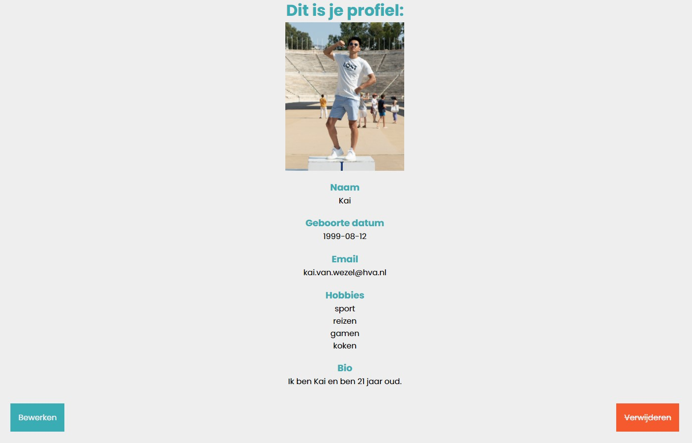

# Bloktech

## Table of content
1. [Matching feature](#matching-feature)
2. [Getting started](#getting-started)
3. [How to use](#how-to-use)
4. [Documentation](#documentation)
5. [License](#license)
6. [Sources](#sources)

## Matching feature

During this project I started working on my first webapplication. The concept is a feature where you can set your interests/hobbies on your profile so people know what you like. This will give you a profile which you can then edit/update or delete from the database.

## Getting started

- Clone repository to local directory/repository using `git clone https://github.com/KaivWezel/Bloktech`.
- Install neccesary packages. `npm install`
- run server `npm run server`

## How to use

* If you have started the server, you can navigate to `localhost:4000` in your browser. 
* You will find a simple menu to walk through and create your first profile.
* After creating, your profile will be presented and you have 2 options, edit and delete.
* If you want to edit some information on your profile, click 'bewerken'.
* if you want to delete your profile, click 'verwijderen' 

## Documentation

For extra documentation, [see the wiki](https://github.com/KaivWezel/Bloktech/wiki)

## LICENSE

Find it [here](https://github.com/KaivWezel/Bloktech/blob/master/LICENSE)

## Sources

* [MongoDB. (z.d.). The most popular database for modern apps. https://www.mongodb.com/](https://www.mongodb.com/)
* [Hogeschool van Amsterdam CMD. (z.d.). Blok Tech. GitHub. https://github.com/cmda-bt](https://github.com/cmda-bt)
